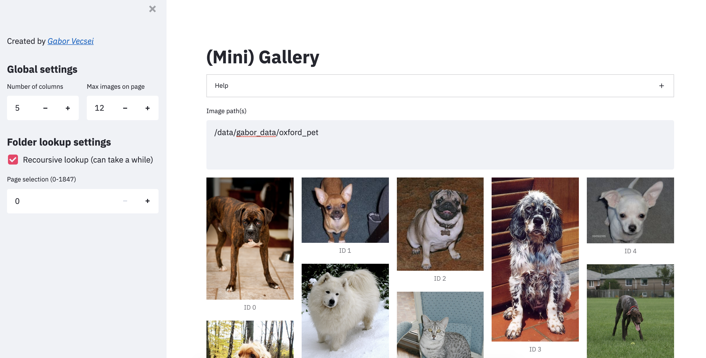

# Mini Gallery

A minimal webui image viewer for quick image inspection on remote servers

</a>

# Install/Setup

## "No clone" setup

```
pip install pillow streamlit
streamlit run https://raw.githubusercontent.com/gaborvecsei/Mini-Gallery/master/mini_gallery/gallery.py
```

# Why?

Most of the time I am working on remote (& headless) servers (living the dream inside the terminal :heart_eyes: only)
and when I need to inspect a few images quickly it is a burden.
We have multiple options like `rsync` or use a `jupyter notebook` but this tool is much faster at doing this
without much manual tinkering.
(Also I could not find a webui gallery app like this, so I made it quickly).

